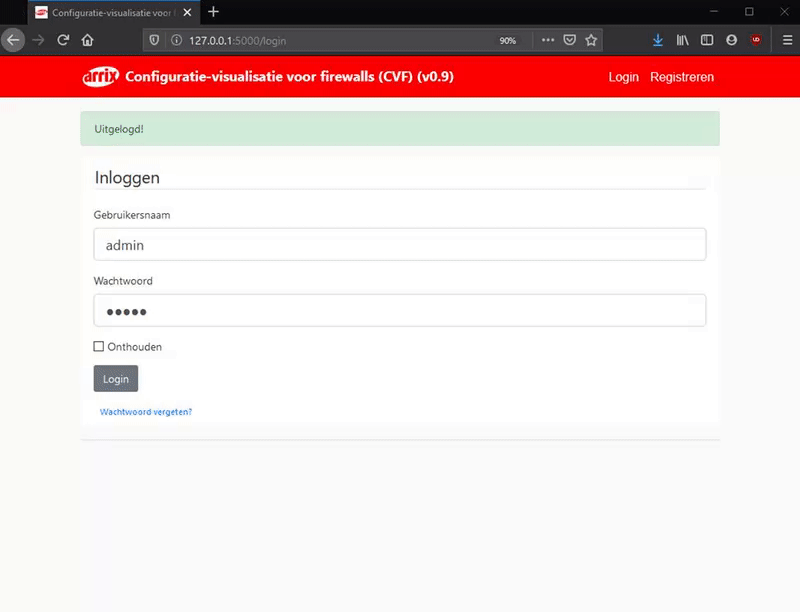
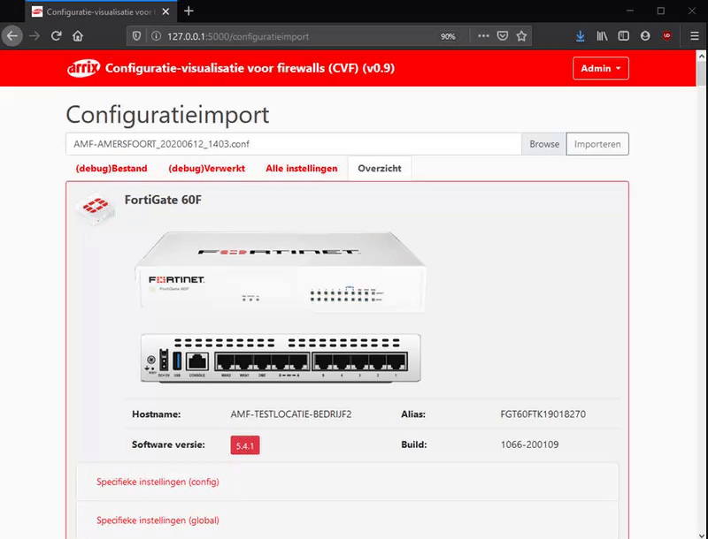
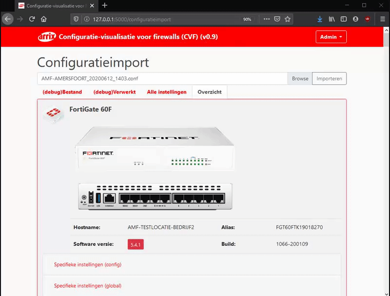
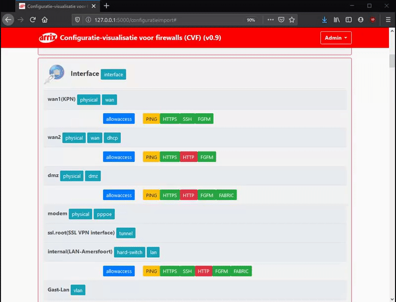
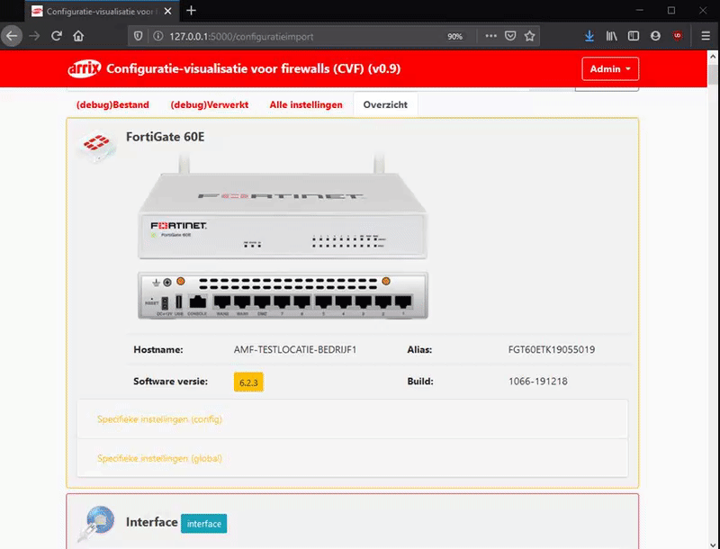

# firewall_configuration_tool
Een (Python flask web-applicatie) die aan de hand van firewallconfiguratie de gebruikte instellingen en impact van deze instellingen weergeeft.

# Installation specification (development)
- Python 3.8.2
- Create virtual enviroment "py -m venv env"
- Activate virtual enviroment "env\Scripts\activate"
- run run.py from virtual enviroment

# pip installs (requirements and dependencys)
- pip install flask
- pip install flask_wtf
- pip install flash
- pip install flask-sqlalchemy
- pip install flask-login
- pip install flask_bcrypt

# media 

 

