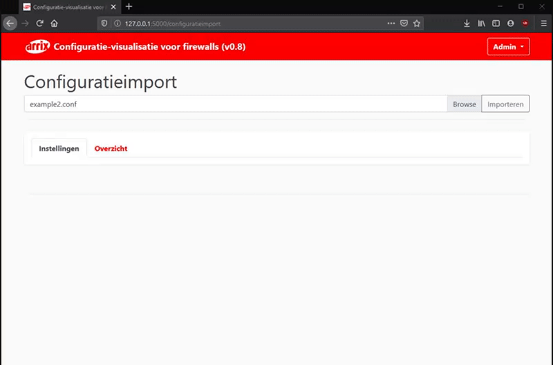
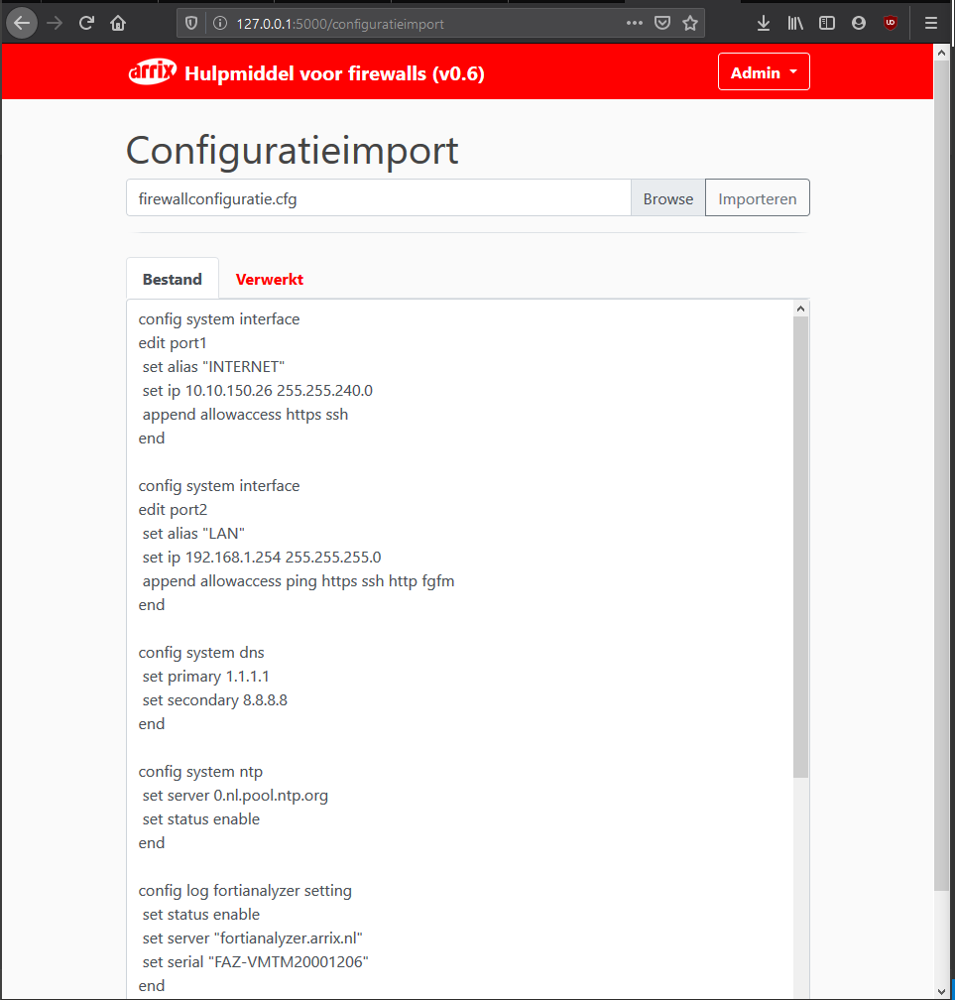
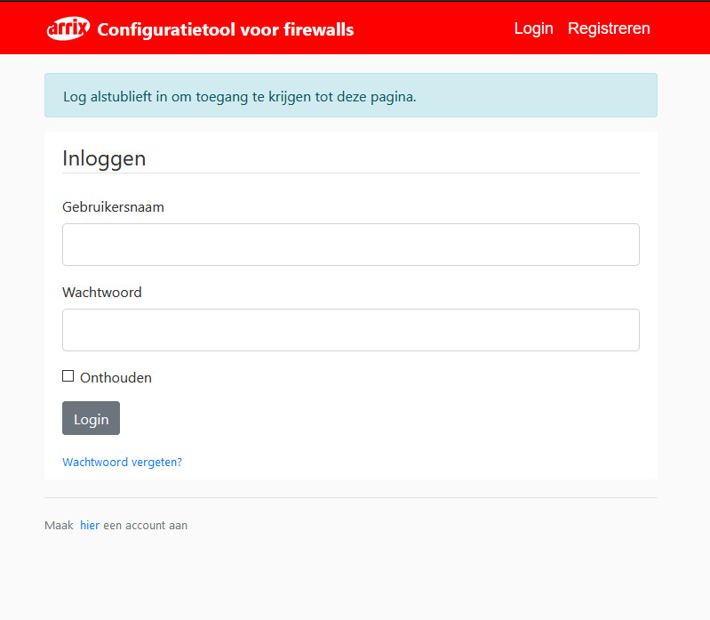

# firewall_configuration_tool
Een (Python flask web-applicatie) die aan de hand van firewallconfiguratie de gebruikte instellingen en impact van deze instellingen weergeeft.

# Installation specification (development)
- Python 3.8.2
- Create virtual enviroment "py -m venv env"
- Activate virtual enviroment "env\Scripts\activate"
- run run.py from virtual enviroment

# pip installs (requirements and dependencys)
- pip install flask
- pip install flask_wtf
- pip install flash
- pip install flask-sqlalchemy
- pip install flask-login
- pip install flask_bcrypt

# done
- web-applicatiepagina
- uiterlijk is gebruiksvriendelijk en in huisstijl 
- paginaformulier voor inloggen en registreren
- mogelijkheid om in te loggen
- mogelijkheid om te registreren
- inloggen en registreren met database
- password hashing
- login sessies
- paginaverwijzingen checken
- basis invulformulier toevoegen
- invulformulier interactief maken
- wijzigen/bekijken van account, attributen aan koppelen
- formulieren.py opdelen, los bestand maken voor configuratieformulieren
- elk configuratieobject, zoals een interface, vpn etc een eigen klasse geven, testen of dit werkt met de submit knop (werkt niet)
- basis back-end maken die de invoer analyseert en kan uitvoeren
- Fortianalyzer configuratieobject toevoegen
- naar sessies kijken of deze kloppen / wat betreft tijd / of het nog nodig is (niet benodigd, wordt al anders gefaciliteerd)
- firewall configurator verplaatsen naar losse pagina
- importeren van een firewall configuratiebestand proberen/testen/uitzoeken
- configuratie output schaalbaar maken met behulp van functies
- textuele feedback testen met de fortianalyzer configuratieoptie
- bestandsnaam weergeven bij import

# todo

- de status van de toggle buttons opslaan, net zoals de div boxes (niet perse benodigd)
- 

# media 

 

