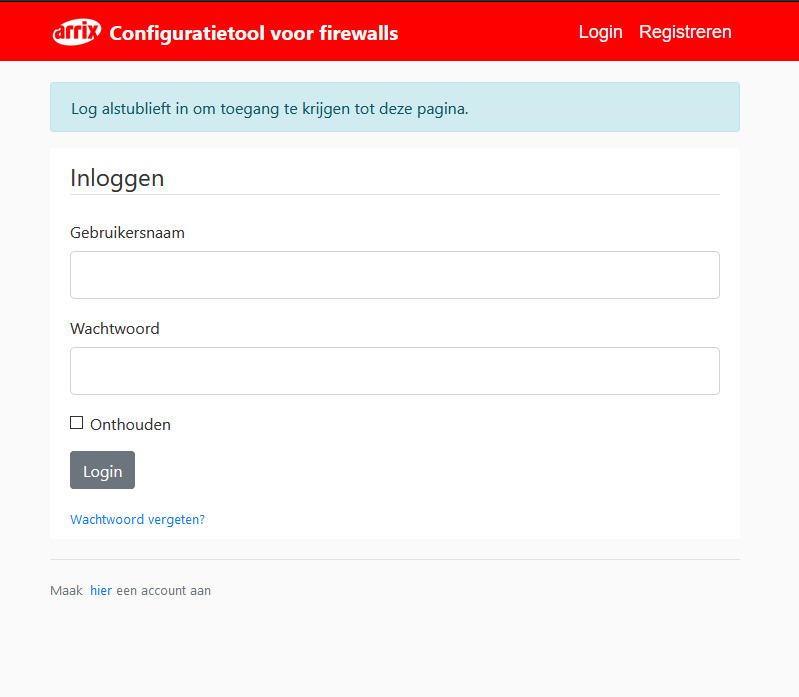
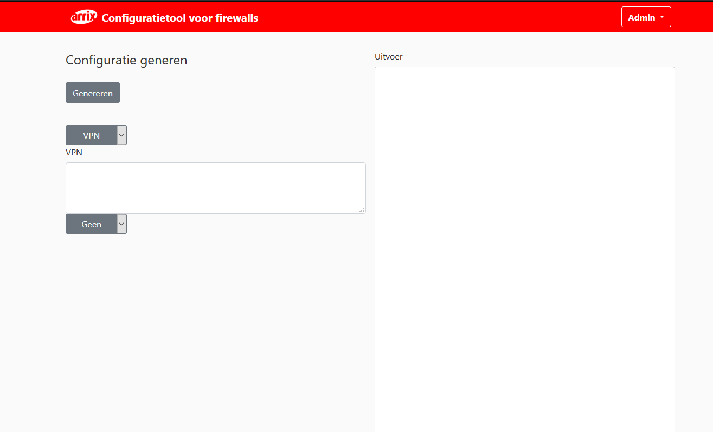
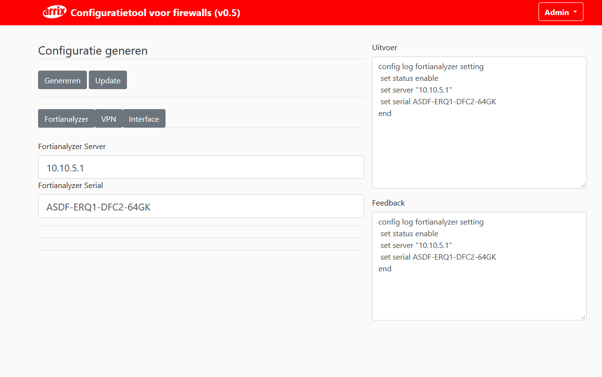

# firewall_configuration_tool
A (Flask web-application) tool which inputs firewall configuration and outputs CLI firewall configuration, security feedback of made setting and general overview of made settings.

# Installation specification (development)
- Python 3.8.2
- Create virtual enviroment "py -m venv env"
- Activate virtual enviroment "env\Scripts\activate"
- set flask (used for flask run) "set FLASK_APP=app.py" (niet meer nodig)

# pip installs 
- pip install flask
- pip install flask_wtf
- pip install flash
- pip install flask-sqlalchemy
- pip install flask-login

# done
- web-applicatiepagina
- uiterlijk is gebruiksvriendelijk en in huisstijl 
- paginaformulier voor inloggen en registreren
- mogelijkheid om in te loggen
- mogelijkheid om te registreren
- inloggen en registreren met database
- password hashing
- login sessies
- paginaverwijzingen checken
- basis invulformulier toevoegen
- invulformulier interactief maken
- wijzigen/bekijken van account, attributen aan koppelen
- formulieren.py opdelen, los bestand maken voor configuratieformulieren
- elk configuratieobject, zoals een interface, vpn etc een eigen klasse geven, testen of dit werkt met de submit knop (werkt niet)
- basis back-end maken die de invoer analyseert en kan uitvoeren
- Fortianalyzer configuratieobject toevoegen
- naar sessies kijken of deze kloppen / wat betreft tijd / of het nog nodig is (niet benodigd, wordt al anders gefaciliteerd)
- firewall configurator verplaatsen naar losse pagina

# todo
- textuele feedback testen met de fortianalyzer configuratieoptie
- configuratieopties toevoegen, kijken naar fortinet vm
- importeren van een firewall configuratiebestand proberen/testen/uitzoeken
- de status van de toggle buttons opslaan, net zoals de div boxes (niet perse benodigd)

# media

